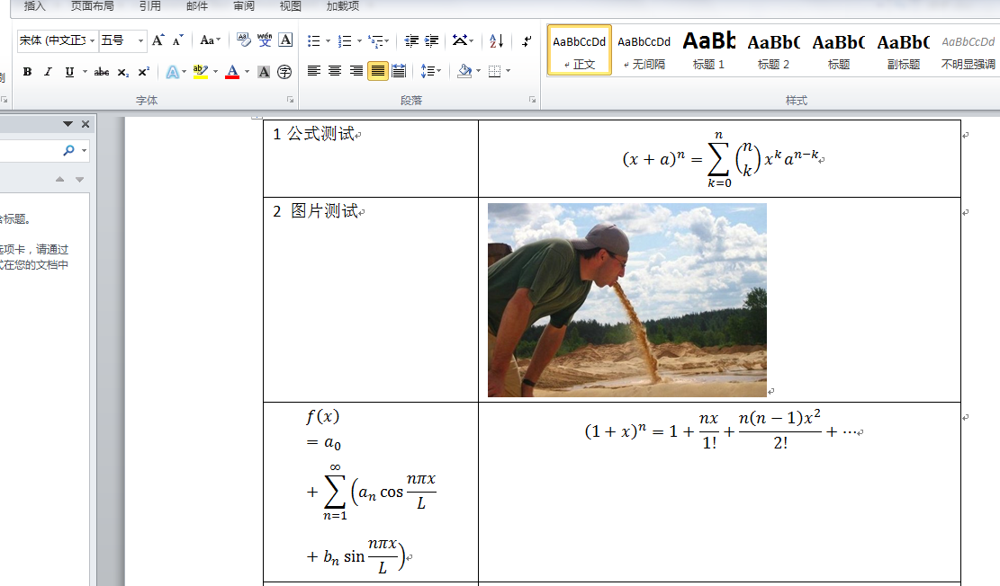
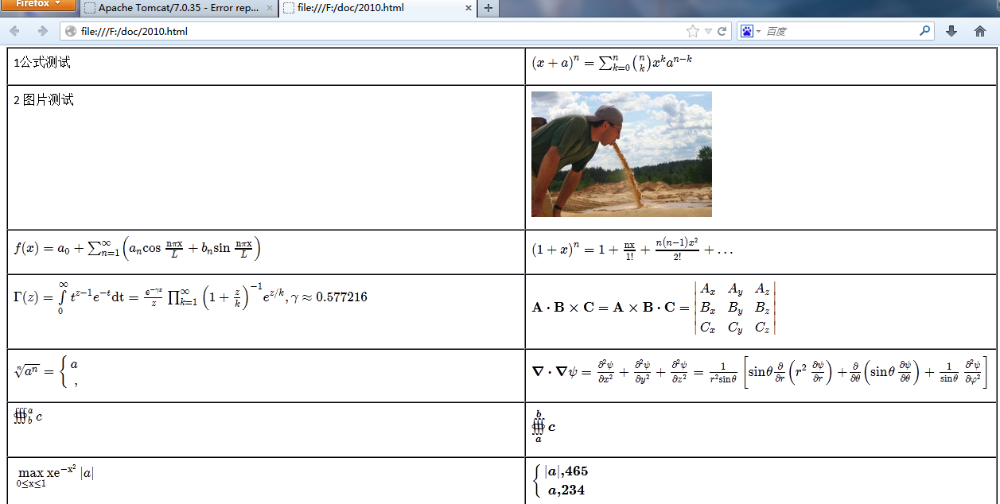

# mathml latex ooxml word相互转化

- 提供mathml latex ooxml相关转化
- 提供 mathml生成 word
- 提供word 公式转mathml
- 提供html+mathml生成word,支持css，table，图片等

## 有公式的word转html思路

 之前实现过，代码已没。提供下思路：
 1. 将docx文件后缀名改成zip
 2. 读取里面的document.xml，提取公式相关的Omath标签，用提供的jar转成mathml或者latex,再写到document.xml中
 3. 利用第三方例如openoffice转word成html
 
 
 
 
 
 qq:329064956
